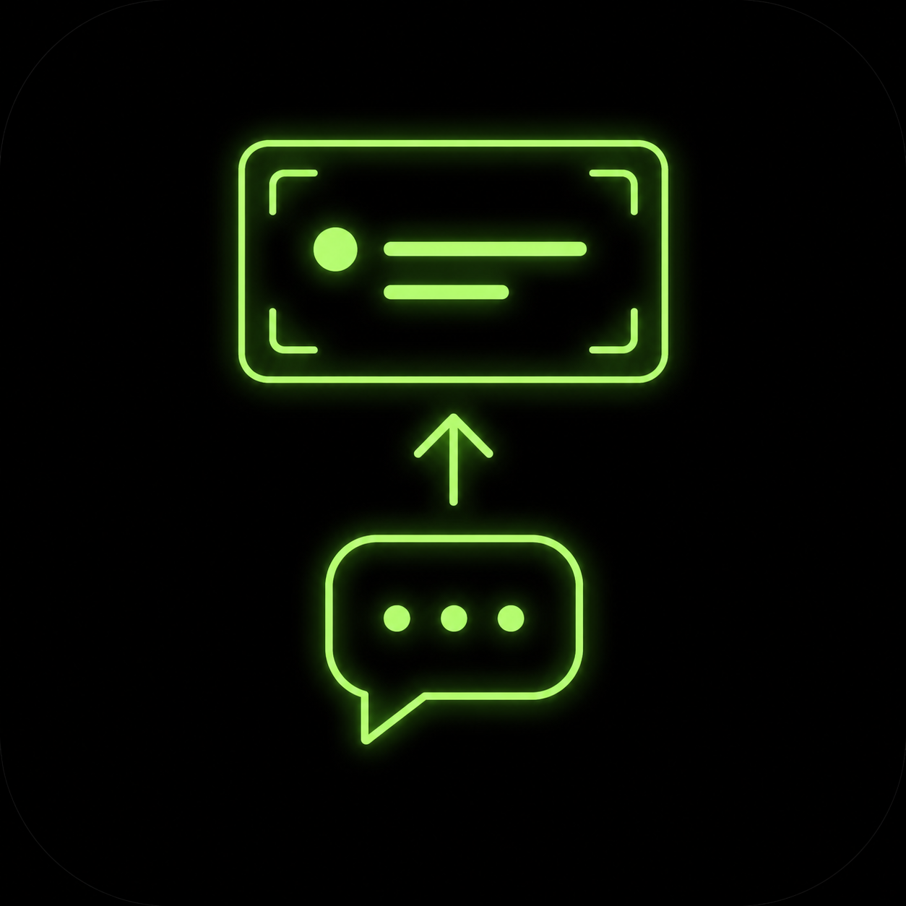
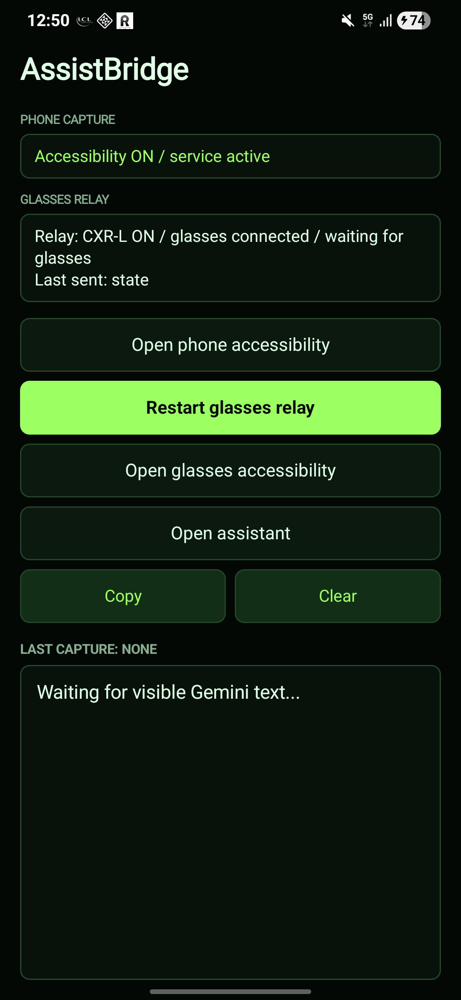
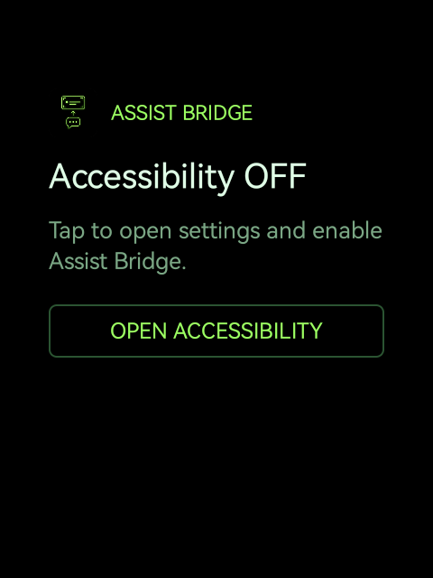
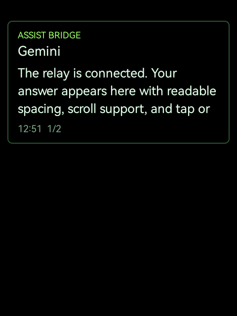

# AssistBridge

<p align="center">
  
</p>

AssistBridge relays visible Gemini / Google Assistant answers from an Android phone to a Rokid glasses HUD.

The phone app captures assistant reply text with Android Accessibility, sends a small JSON message through Hi Rokid / CXR-L, and the glasses app renders it as a readable AR popup with one-axis scrolling and tap / OK dismissal.

## Screenshots

<p align="center">
  
  
  
</p>

## Apps

- Phone app: `com.anezium.assistbridge.phone`
- Glasses app: `com.anezium.assistbridge.glasses`

## Features

- Captures visible Gemini / Google Assistant answer text on the phone.
- Filters common assistant chrome, transient states, and full-screen Gemini app surfaces.
- Relays assistant answers to Rokid glasses over CXR-L.
- Bundles the glasses APK inside the phone APK for CXR-L install / update flows.
- Shows a black, AR-safe popup on glasses with phosphor green accents.
- Keeps the popup visible until the user taps / presses OK.
- Supports left / right Rokid swipe events for scrolling long answers.
- Includes setup buttons for both phone and glasses accessibility services.

## Requirements

- Android phone with Gemini or Google Assistant.
- Rokid glasses paired with the Global Hi Rokid app.
- Android Accessibility enabled for AssistBridge on the phone.
- AssistBridge accessibility enabled on the glasses for overlay keys and swipe handling.
- Hi Rokid CXR-L authorization accepted on the phone.

On recent Android versions, sideloaded accessibility services may require `Allow restricted settings` from the Android app info screen before they can be enabled.

Assistant replies over the lock screen depend on Gemini / Google Assistant settings. Enable assistant responses on the lock screen / screen off if you want the Rokid voice path to work while the phone is locked.

## Install

Download the APKs from the latest GitHub release:

- `AssistBridge-phone-v0.2.0.apk`
- `AssistBridge-glasses-v0.2.0.apk`

Typical setup:

1. Install the phone APK.
2. Open AssistBridge on the phone.
3. Enable the phone accessibility service.
4. Authorize / start the glasses relay from the phone app.
5. Open AssistBridge on the glasses and enable the glasses accessibility service.
6. Ask Gemini a question through the phone assistant or the Rokid voice flow.

Manual ADB install:

```powershell
adb install -r AssistBridge-phone-v0.2.0.apk
adb -s <glasses-serial> install -r AssistBridge-glasses-v0.2.0.apk
```

The phone APK also contains `assets/assist-bridge-glasses.apk`, so the phone relay can install or update the glasses app through the CXR-L path when authorized.

## Controls On Glasses

- Tap / OK: dismiss the popup.
- Back: dismiss the popup.
- Swipe left / right: scroll long answers.

## Build From Source

AssistBridge uses the public `Anezium/CxrGlobal` wrapper for Global Hi Rokid CXR-L support.

```powershell
git clone --recursive https://github.com/Anezium/AssistBridge.git
cd AssistBridge
git submodule update --init --recursive
.\gradlew.bat :phone-app:assembleRelease :glasses-app:assembleRelease
```

For local Rokid workspace development, `settings.gradle.kts` also accepts a sibling checkout at `../CxrGlobal`.

Release APKs are signed with the Android debug keystore for sideload testing. Replace the signing config before wider distribution.

## Privacy And Safety

AssistBridge does not call a cloud API and does not run its own network backend. It watches only the Google app / Gemini app accessibility surfaces on the phone and sends the captured visible answer text to the paired glasses through Hi Rokid / CXR-L.

Captured assistant text is kept locally for the current app state / last capture display. Release builds redact captured answer previews from logcat.

Android Accessibility capture is best-effort. Google can change Gemini / Assistant UI structure, text labels, or lock-screen behavior, so capture filters may need updates over time.
